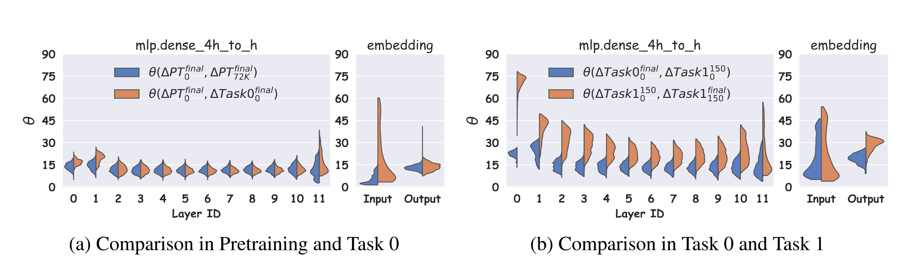
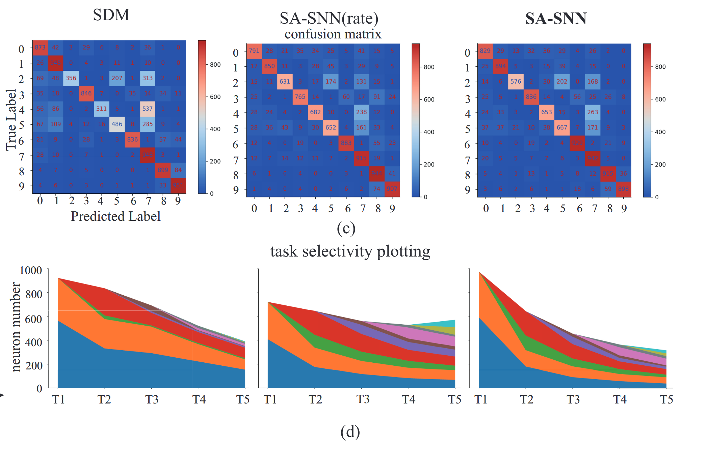
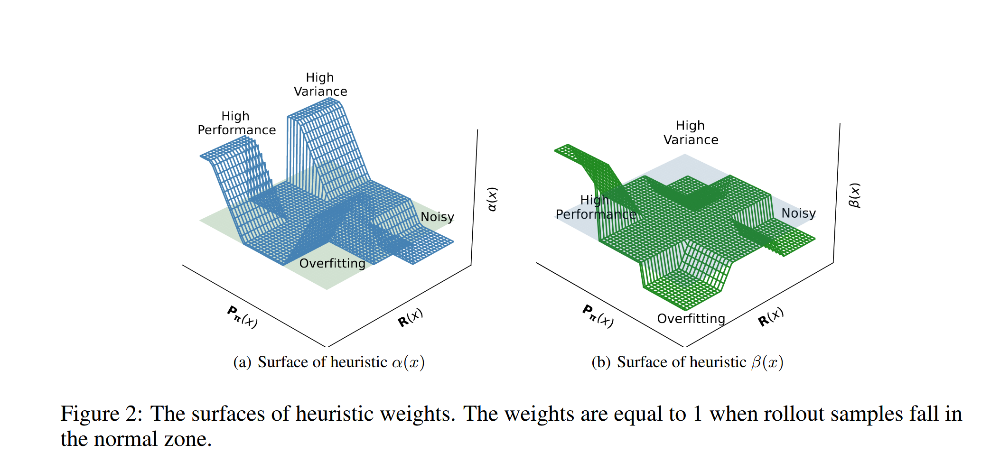
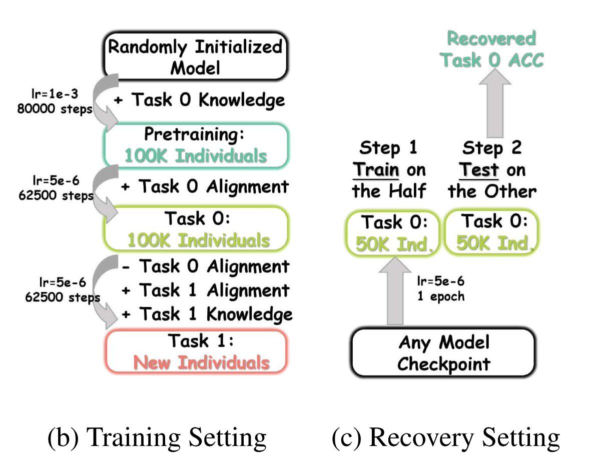

[50种Matplotlib科研论文绘图合集，含代码实现 - 知乎](https://zhuanlan.zhihu.com/p/220345912)

不同方法的比较可视化解释

损失域的可视化解释

y 轴是初始 150 步的权重更新方向，x 轴是后续步骤中的权重更新方向。

模型权重视角

可以尝试在图像和文字领域

可视化热力图

特征LLM提取器，激活对应的Lora

这种立体图看起来非常舒服

## 其他可视化类型

### 实验设置可视化

训练的设置，比如到多少步，做XXX操作